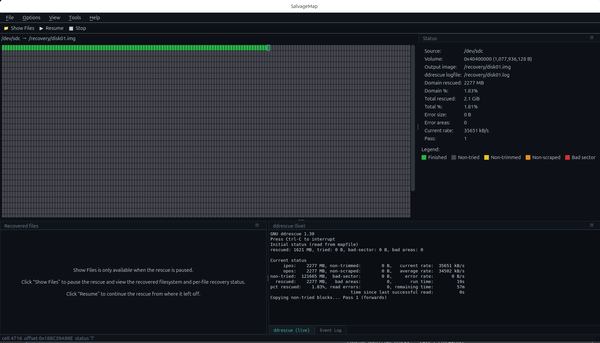

# SalvageMap

> ⚠️ **No warranty — use at your own risk.** This tool reads from failing
> storage. Any read activity against a dying drive can hasten its failure, and
> recovery is never guaranteed. **Always work on a healthy spare drive, never
> the customer's original, and image to a separate target.** The source device
> is always opened read-only and the app refuses to use a block device or the
> source itself as the output target, but you remain responsible for selecting
> the correct devices. This software is provided "as is", without warranty of
> any kind (see [LICENSE](LICENSE)).



A Linux GUI wrapper over [GNU ddrescue](https://www.gnu.org/software/ddrescue/),
in the style of FTK / DMDE / Data Extractor:

- **Live sector map** — the ddrescue mapfile rendered as a grid of tall coloured
  rectangles (green = finished, red = bad sector, …), updating as a rescue runs.
- **Targeted recovery** — for a failing drive that will never image 100%, read
  in *priority order* and extract the most valuable data first. **ddrescue is the
  only thing that ever reads the failing device; every structure is parsed from
  the output image.** A filesystem-agnostic engine images the partition table and
  each partition's boot record, **detects the filesystem from the image**, then
  walks a per-filesystem plan. Currently supported:

  | Filesystem | Metadata imaged in priority order | File data |
  | --- | --- | --- |
  | **NTFS** | boot sector → `$MFT` record 0 (own runs) → full `$MFT` → every directory's `$INDEX_ALLOCATION` | all allocated `$DATA` (resident small files already in the `$MFT`) |
  | **ext4** | superblock → group descriptor table → every inode table → every directory's data blocks | every regular file's extents (ext3/ext2 indirect-block files are counted but skipped) |
  | **HFS+** | volume header → Extents Overflow file → Catalog B-tree | every file's data-fork extents (compressed/resource-fork files are counted but skipped) |

  Each phase runs `ddrescue --domain-mapfile` into the same image + logfile, so
  the sector map fills in cumulatively. Free space is always skipped. **File ▸
  Export file-data Domain File** writes the best domain file so you can re-run
  `ddrescue -m` manually with your own settings.

- **Fragmentation-aware** — a large, heavily-fragmented file (e.g. video) scatters
  its data across the disk, and the map of *where* often lives in a secondary
  structure: the HFS+ **Extents Overflow file**, an NTFS **`$ATTRIBUTE_LIST`** /
  extension records, or a deep ext4 **extent tree**. SalvageMap resolves those so
  a folder's domain includes every scattered extent, not just the first few. When
  that map can't be fully resolved yet (the metadata holding it isn't imaged), the
  file is flagged rather than silently truncated.
- **Per-file recovery status** — in the paused **Show Files** view each entry gets
  a coloured box: clear = not imaged, light green = partial, **dark green = fully
  recovered**, amber = as complete as the current map allows but known-incomplete,
  red = tried but unreadable. Right-click a folder to **image it first**, or run a
  final completeness pass to retry everything not yet whole.
- **Customer reports** — from the paused **Show Files** view, **Export to TXT**
  writes a plain, easy-to-read tree marking each entry *Recovered* / *Not
  recovered*, and **Export to HTML** produces a single self-contained,
  dark-mode, mobile- and desktop-friendly report you can browse, search and
  filter — with an optional logo so data-recovery professionals can brand it.
  The HTML renders lazily, so even disks with hundreds of thousands of files
  open instantly, and hidden/filesystem-internal clutter (`.DS_Store`,
  Spotlight, HFS+ private data, …) is omitted by default.

## Install (Ubuntu)

The easiest way to try SalvageMap is the prebuilt `.deb` — no building, no pip.
It requires **Ubuntu 24.04 or newer** (that's where apt ships the
`python3-pyside6.*` packages it depends on; verified on 24.04 and 26.04). On
**Ubuntu 22.04 or older**, skip to [Run from source](#run-from-source-ubuntu-2204-or-older-or-non-debian).

**1. Download** the latest `salvagemap_*.deb` from the
[**Releases page**](https://github.com/champlinguys/SalvageMap/releases/latest)
(under *Assets*). Or grab it from a terminal:

```sh
wget https://github.com/champlinguys/SalvageMap/releases/download/v0.1.2/salvagemap_0.1.2_all.deb
```

**2. Install** it — double-click the file to open it in Ubuntu's software
installer, or run:

```sh
sudo apt install ./salvagemap_0.1.2_all.deb
```

apt pulls in PySide6, GNU ddrescue, ntfs-3g and the Qt xcb libraries
automatically.

**3. Launch** **SalvageMap** from your applications menu (it prompts for a
password so it can read raw disks), or run `salvagemap` from a terminal.

To build the `.deb` yourself: `packaging/build-deb.sh` (output in `dist/`).
Pushing a `vX.Y.Z` tag builds and publishes it via GitHub Actions
(`.github/workflows/release.yml`).

### Run from source (Ubuntu 22.04 or older, or non-Debian)

Older Ubuntu has no PySide6 in apt, so install it from pip into a virtualenv:

```sh
# system tools (these exist on 22.04)
sudo apt install gddrescue ntfs-3g libxcb-cursor0 git python3-venv python3-pip

git clone https://github.com/champlinguys/SalvageMap.git
cd SalvageMap
python3 -m venv .venv
. .venv/bin/activate
pip install PySide6

# let it read raw disks without running the GUI as root:
sudo usermod -aG disk $USER      # then LOG OUT and back in for this to take effect

.venv/bin/python3 -m app.main
```

`libxcb-cursor0` is required by Qt 6.5+ for the X11 plugin — without it the app
aborts with *"Could not load the Qt platform plugin xcb"*. The `usermod` step
only applies to a **new login session**, so log out and back in (or reboot)
before running; check with `groups` that `disk` is listed.

If you'd rather run it as root, forward your display so the GUI can reach it:

```sh
xhost +SI:localuser:root
sudo -E .venv/bin/python3 -m app.main
# when finished: xhost -SI:localuser:root
```

## Requirements

To run from source instead:

- Python 3.10+
- PySide6 (Qt 6)
- `ddrescue` (1.20+; tested with 1.30) on `PATH`
- For tests: `pytest`, plus the filesystem tools used by the integration checks
  (`ntfs-3g` / `mkntfs` for NTFS, `e2fsprogs` / `mke2fs` for ext4, and
  `hfsprogs` for HFS+)

On Debian/Ubuntu:

```sh
sudo apt-get install gddrescue python3-pyside6.qtwidgets python3-pyside6.qtgui \
                     python3-pyside6.qtcore python3-pytest ntfs-3g
```

## Run

```sh
python3 -m app.main
```

Then **File ▸ Open Device…** to choose the source device and an output image,
and **Options ▸ Targeted Recovery ▸ Run full workflow**. The filesystem (NTFS,
ext4, or HFS+) is detected automatically from the imaged partition. Use **File ▸
Open Mapfile** to view any existing ddrescue mapfile read-only.

> The source is always opened read-only by ddrescue; the app refuses to use a
> block device or the source itself as the output target.

While a rescue is running, the **Recovered files** pane stays empty — parsing
the `$MFT` and colouring every file against the mapfile is too heavy to do live.
Click **Show Files** in the toolbar to pause the rescue (progress is saved to
the logfile) and browse the recovered filesystem with per-file recovery status,
then **Resume** to continue ddrescue from where it left off.

## Layout

```
app/
  main.py                     entry point
  ui/        main_window, sector_map, status_panel, log_panel, file_tree_panel
  core/      recovery (filesystem-agnostic phase engine + plan interface),
             mapfile (parse/aggregate), domain (domain-mapfile builder),
             volume (filesystem detection), ddrescue_runner (QProcess + guards)
  ntfs/      runlist, boot_sector, mft (incl. $ATTRIBUTE_LIST), filetree, plan
  ext/       superblock, group_desc, inode, extents, dirent, catalog, plan
  hfsplus/   volume_header, btree, extents (overflow), catalog, plan
tests/       unit tests + sample mapfile
```

## Tests

```sh
python3 -m pytest -q
```

## License

Copyright (C) 2026 Champlin Guys Data Recovery.

This project is licensed under the **GNU General Public License v3.0 or later**
(GPL-3.0-or-later). See [LICENSE](LICENSE) for the full text.

## Acknowledgements

This app does not contain, link, or bundle any of the software below — it
invokes `ddrescue` as a separate command-line process and depends on PySide6 as
an external library. They are credited here with gratitude:

- **[GNU ddrescue](https://www.gnu.org/software/ddrescue/)** by Antonio Diaz
  Diaz — the data-recovery engine that does all reading from the source device.
  Licensed under the GPLv3. Install it yourself (`apt-get install gddrescue`);
  it is not distributed with this project.
- **[Qt for Python (PySide6)](https://wiki.qt.io/Qt_for_Python)** — the GUI
  toolkit, licensed under the LGPLv3.
