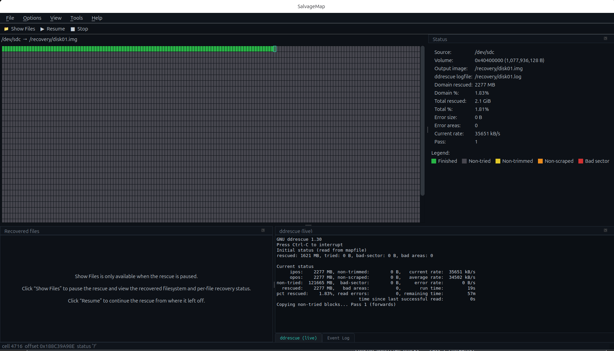

# SalvageMap

> ⚠️ **No warranty — use at your own risk.** This tool reads from failing
> storage. Any read activity against a dying drive can hasten its failure, and
> recovery is never guaranteed. **Always work on a healthy spare drive, never
> the customer's original, and image to a separate target.** The source device
> is always opened read-only and the app refuses to use a block device or the
> source itself as the output target, but you remain responsible for selecting
> the correct devices. This software is provided "as is", without warranty of
> any kind (see [LICENSE](LICENSE)).



A Linux GUI over [GNU ddrescue](https://www.gnu.org/software/ddrescue/), in the
style of FTK / DMDE / Data Extractor.

The problem it solves: a dying drive has a limited number of reads left in it,
and a straight `ddrescue` pass spends them in physical order — reading empty
space and OS junk with the same urgency as the customer's photos. SalvageMap
reads the filesystem's own maps out of the partial image and tells ddrescue
which sectors actually matter, **in priority order**. Free space is never read
at all. If the drive dies halfway through, you have the most valuable data
rather than the first half of the platter.

It handles **NTFS, ext4 and HFS+**, unlocks **BitLocker** and **Mac FileVault 2**
volumes, and produces a browsable file tree with per-file recovery status you
can hand to a customer as a report.

---

## Install

### Ubuntu 24.04 or newer — the `.deb`

Download the latest `salvagemap_*.deb` from the
[**Releases page**](https://github.com/champlinguys/SalvageMap/releases/latest)
(under *Assets*), or from a terminal:

```sh
wget https://github.com/champlinguys/SalvageMap/releases/download/v0.3.0/salvagemap_0.3.0_all.deb
sudo apt install ./salvagemap_0.3.0_all.deb
```

That single command pulls in **everything** — you do not need to install
ddrescue or anything else by hand:

| Pulled in | What it's for |
| --- | --- |
| `gddrescue` | GNU ddrescue — the engine that does all reading from the failing drive |
| `python3-pyside6.*` | the Qt 6 GUI |
| `python3-cryptography` | AES for **BitLocker** unlocking |
| `ntfs-3g`, `libxcb-cursor0` | NTFS tooling and the Qt X11 plugin |
| `python3-libfvde` | **FileVault 2 / CoreStorage** unlocking (Mac drives) |

`python3-libfvde` is a *recommendation* rather than a hard dependency, so a
plain `apt install` gets it but `--no-install-recommends` will skip it. Without
it everything else still works and the unlock dialog tells you what to install:

```sh
sudo apt install python3-libfvde libfvde-utils
```

Then launch **SalvageMap** from your applications menu (it prompts for a
password so it can read raw disks), or run `salvagemap` from a terminal.

### Run from source (Ubuntu 22.04 or older, or non-Debian)

Older Ubuntu has no PySide6 in apt, so install it from pip into a virtualenv:

```sh
# system tools (these exist on 22.04)
sudo apt install gddrescue ntfs-3g libxcb-cursor0 git python3-venv python3-pip

# optional: Mac FileVault 2 support
sudo apt install python3-libfvde libfvde-utils

git clone https://github.com/champlinguys/SalvageMap.git
cd SalvageMap
python3 -m venv .venv
. .venv/bin/activate
pip install PySide6 cryptography

# let it read raw disks without running the GUI as root:
sudo usermod -aG disk $USER      # then LOG OUT and back in for this to take effect

.venv/bin/python3 -m app.main
```

`libxcb-cursor0` is required by Qt 6.5+ for the X11 plugin — without it the app
aborts with *"Could not load the Qt platform plugin xcb"*. The `usermod` step
only applies to a **new login session**, so log out and back in (or reboot)
before running; check with `groups` that `disk` is listed.

If you'd rather run it as root, forward your display so the GUI can reach it:

```sh
xhost +SI:localuser:root
sudo -E .venv/bin/python3 -m app.main
# when finished: xhost -SI:localuser:root
```

> **Note:** `python3-libfvde` has no pip equivalent — it must come from apt even
> in a virtualenv setup. On non-Debian systems, build
> [libfvde](https://github.com/libyal/libfvde) with its Python bindings.

---

## Format your drop-off drive as ext4

**This one choice can be the difference between a 600 MB image and a 14 TB one.**

SalvageMap pre-sizes the output image to the full size of the source device
before imaging starts. That matters: a short `.img` makes partition tools reject
the GPT and looks exactly like total partition loss. But it means the file
*claims* to be as big as the source drive.

On a filesystem with **sparse-file support**, that costs nothing — the image only
consumes the blocks actually written. A real example, a 14 TB Mac drive taken as
far as a browsable directory tree:

| | |
| --- | --- |
| Size the image reports (`ls -l`) | 14,000,486,088,704 bytes — the full source device |
| Space it actually used (`du`) | **613 MB** |

| Format | Verdict |
| --- | --- |
| **ext4** | ✅ **Use this.** Sparse files, up to 16 TiB per image |
| **XFS** | ✅ Also fine, and no 16 TiB image ceiling — for drives above that |
| exFAT | ❌ No sparse support on Linux — a 14 TB source really costs 14 TB |
| NTFS (ntfs-3g) | ❌ Sparse support is unreliable |
| FAT32 | ❌ 4 GiB maximum file size — unusable for any real image |

```sh
sudo mkfs.ext4 -L DROPOFF /dev/sdX1
```

If the customer needs their data on an exFAT drive at the end, that's a separate
copy of the *recovered files* — keep the working image itself on ext4.

---

## Your first recovery

1. **Connect the source drive** — read-only, through a write blocker if you have
   one. SalvageMap opens it read-only regardless and refuses to write to a block
   device, but the habit is worth keeping.
2. **File ▸ Choose Block Device…** (`Ctrl+D`) — pick the source device and an
   output image path on your ext4 drop-off drive.
3. **Options ▸ Targeted Recovery ▸ Run full workflow (metadata + file data)**.

That's it. The workflow detects the partition table, picks the data partition,
identifies the filesystem from what it just imaged, prompts you if the volume is
encrypted, and works through the phases in priority order. Watch the sector map
fill in as it goes.

4. **Click 📁 Show Files** on the toolbar at any point to *pause* the rescue and
   browse what you have so far, with per-file recovery status. Progress is saved
   — **▶ Resume** picks up exactly where it left off.
5. **Right-click any folder ▸ Image this folder first** to jump the queue (see
   below).
6. When the drive is as recovered as it's going to get, run **Options ▸ Targeted
   Recovery ▸ Final completeness pass** to retry everything not yet whole.
7. From the paused file view, **Export to TXT** or **Export to HTML** for a
   customer report.

If you'd rather drive it phase by phase, the same menu has **Step 1: Recover
filesystem metadata**, **Step 2/3: Map & rescue directory structure** and
**Step 4: Image all file data** as separate actions. **Options ▸ Start
full-device rescue** (`Ctrl+R`) does a conventional straight-through image when
that's what you want.

Resuming an earlier job: **File ▸ Import previous logfile + image…** (`Ctrl+O`).

---

## How targeted recovery works

The core idea in one line: **ddrescue is the only thing that ever touches the
failing drive; every filesystem structure is parsed out of the image you're
building.**

That inversion is what makes prioritising possible. The app never goes back to
the dying disk to "have a look" — it reads what it already rescued, works out
what to ask for next, and hands ddrescue a precise list of sectors.

The order is deliberate:

1. **Partition table**, then each partition's boot record — a few KB. Now it
   knows the layout and which filesystem it's dealing with.
2. **Filesystem metadata** — the `$MFT`, the inode tables, the Catalog B-tree.
   Small relative to the disk, and it's the map of *everything*. Get this and
   you know every file's name, size and location, even for files you haven't
   recovered yet.
3. **Directory structure**, so the tree is browsable and you can make decisions.
4. **File data** — every allocated extent, and nothing else. Free space is never
   read.

Each phase runs `ddrescue --domain-mapfile` into the same image and logfile, so
the sector map fills in cumulatively and nothing is ever read twice. Because the
metadata comes first, a drive that dies at step 4 still leaves you a complete
picture of what *was* on it — which is often enough to tell a customer what they
lost, and worth having on its own.

**File ▸ Export file-data Domain File…** writes the domain file out so you can
re-run `ddrescue -m` by hand with your own settings.

---

## Browsing files and imaging by priority

While a rescue is running the **Recovered files** pane stays empty — parsing the
filesystem and colouring every file against the mapfile is far too heavy to do
live. Click **📁 Show Files** to pause and build the tree.

Each entry gets a coloured box:

| | Meaning |
| --- | --- |
| ⬜ clear | not imaged yet |
| 🟩 light green | partially recovered |
| 🟢 **dark green** | **fully recovered** |
| 🟧 amber | as complete as the current map allows, but known-incomplete |
| 🟥 red | tried, unreadable |

**Right-click a folder ▸ "Image this folder first"** (or a single file ▸ *"Image
this file first"*) and SalvageMap builds a domain from every extent belonging to
that subtree and images it immediately, ahead of everything else.

This is the feature to reach for when the drive is clearly dying and the
customer has told you what matters. Get their Photos folder while the drive
still answers, then let the general pass carry on with whatever time is left.

Amber entries are worth understanding: a heavily-fragmented file's extent map
often lives in a *secondary* structure — the HFS+ Extents Overflow file, an NTFS
`$ATTRIBUTE_LIST`, a deep ext4 extent tree. If that structure isn't recovered
yet, SalvageMap images the extents it can locate and flags the file rather than
silently handing back a truncated video. Recovering more metadata and re-running
the completeness pass can turn amber into green.

---

## Encrypted drives

Both schemes work the same way and preserve the same guarantee: **the image
keeps the ciphertext exactly as ddrescue read it.** Nothing is ever decrypted
onto disk, the key or password is never written down, and reads of that volume
are decrypted in memory on the way past. The file tree, per-file status and
*image this folder first* all behave exactly as on an unencrypted drive.

You'll be offered the unlock automatically when a locked volume turns up, or you
can reach for it directly:

- **BitLocker** — **Tools ▸ Unlock BitLocker volume…**, with the 48-digit
  recovery key. The dialog shows the protector *Identifier* so you can confirm
  the key file in front of you belongs to this drive — getting that wrong is the
  usual reason an unlock fails.
- **FileVault 2 (Mac)** — **Tools ▸ Unlock CoreStorage volume…**, with the
  password the customer uses to unlock the disk. Needs `python3-libfvde`.

A Mac drive is worth a word of warning: **image the whole disk, not just the big
partition.** FileVault's container metadata includes copies at the *far end* of
the disk, and the EFI and Booter partitions carry a fallback the unlock can need.
The workflow handles this for you — it inserts an **Imaging CoreStorage
metadata** phase, fetches the ~144 MiB required, unlocks and carries straight on
— but only if you pointed it at the whole device.

Both are found by signature scan, so a partial rescue with **no readable
partition table** still opens.

---

## Customer reports

From the paused **Show Files** view:

- **Export to TXT** — a plain, easy-to-read tree marking each entry *Recovered* /
  *Not recovered*.
- **Export to HTML** — a single self-contained, dark-mode, mobile- and
  desktop-friendly report you can browse, search and filter, with an optional
  logo so data-recovery professionals can brand it. It renders lazily, so disks
  with hundreds of thousands of files still open instantly, and
  hidden/filesystem-internal clutter (`.DS_Store`, Spotlight, HFS+ private data,
  …) is omitted by default.

---

## Reference

<details>
<summary><b>What each filesystem plan images, in order</b></summary>

| Filesystem | Metadata imaged in priority order | File data |
| --- | --- | --- |
| **NTFS** | boot sector → `$MFT` record 0 (own runs) → full `$MFT` → every directory's `$INDEX_ALLOCATION` | all allocated `$DATA` (resident small files already in the `$MFT`) |
| **ext4** | superblock → group descriptor table → every inode table → every directory's data blocks | every regular file's extents (ext3/ext2 indirect-block files are counted but skipped) |
| **HFS+** | volume header → Extents Overflow file → Catalog B-tree | every file's data-fork extents (compressed/resource-fork files are counted but skipped) |

The filesystem is detected from the *image*, not assumed from the partition
type, so an unlocked encrypted volume is recognised as whatever it actually
holds.

</details>

<details>
<summary><b>BitLocker internals</b></summary>

The volume is found by its `-FVE-FS-` signature even when sector 0 never came
back, so a partial rescue with no readable partition table still opens.

Supports AES-XTS-128/256 and AES-CBC-128/256. The Vista-era Elephant-diffuser
variants are detected and **refused** rather than silently mis-decrypted.

BitLocker relocates the volume's original boot region, so plaintext and physical
offsets differ across that one range — the imaging domain accounts for the shift,
which is why *image this folder first* targets the right sectors on an unlocked
volume.

</details>

<details>
<summary><b>FileVault 2 / CoreStorage internals</b></summary>

Key derivation is delegated to [libfvde](https://github.com/libyal/libfvde)
(`python3-libfvde`); detection is native, so the drives picker and a partial
image work with nothing installed.

**Container metadata is not where you'd expect.** Two of the copies live at the
*far end* of the disk — 12.7 TiB in on the reference drive — nowhere near the
64 KiB per partition that partition detection images. The **Imaging CoreStorage
metadata** phase images the ~144 MiB libfvde needs (determined by recording which
sectors it actually reads), then unlocks and continues into the HFS+ plan in the
same run. Without it the unlock fails in a way that reads exactly like a wrong
password.

**libfvde cannot decrypt past 1 TiB** of a logical volume — a 32-bit index limit
in the library. This does not affect recovery: ddrescue images ciphertext, and
the HFS+ catalog and extents overflow live near the start of the volume. It does
mean the mapping below is measured only up to that ceiling, and proved beyond it.

**Where the logical volume physically lives is measured, not assumed.**
CoreStorage allocates it out of segments of the partition and libfvde does not
expose that map, so SalvageMap watches which sectors libfvde actually reads and
bisects to pin the segment boundaries. Above the 1 TiB ceiling a uniform shift is
extended only when it can be *proved*: the volume has to fit the gap between the
container's front and end-of-disk metadata, and on a full-disk volume that leaves
no room for a second segment. A fixed shift would work on a freshly-encrypted
disk and silently image the wrong sectors on a resized one. Where the proof
fails, the whole partition is imaged instead — imaging too much is slow, imaging
the wrong place loses the recovery.

`tools/cs-diagnose.py <image>` walks the whole chain against an image and reports
which link is missing if a CoreStorage recovery comes up empty.

</details>

<details>
<summary><b>Fragmentation handling</b></summary>

A large, heavily-fragmented file (e.g. video) scatters its data across the disk,
and the map of *where* often lives in a secondary structure: the HFS+ **Extents
Overflow file**, an NTFS **`$ATTRIBUTE_LIST`** / extension records, or a deep
ext4 **extent tree**. SalvageMap resolves those so a folder's domain includes
every scattered extent, not just the first few. When that map can't be fully
resolved yet (the metadata holding it isn't imaged), the file is flagged rather
than silently truncated.

</details>

## Requirements

Only needed if you're running from source — the `.deb` handles all of this.

- Python 3.10+
- PySide6 (Qt 6)
- `cryptography` (for BitLocker unlocking)
- `python3-libfvde` (optional; only for Mac CoreStorage / FileVault 2 unlocking)
- `ddrescue` (1.20+; tested with 1.30) on `PATH`
- For tests: `pytest`, plus the filesystem tools used by the integration checks
  (`ntfs-3g` / `mkntfs` for NTFS, `e2fsprogs` / `mke2fs` for ext4, and
  `hfsprogs` for HFS+)

On Debian/Ubuntu:

```sh
sudo apt-get install gddrescue python3-pyside6.qtwidgets python3-pyside6.qtgui \
                     python3-pyside6.qtcore python3-cryptography python3-pytest \
                     ntfs-3g python3-libfvde
```

Building the `.deb` yourself: `packaging/build-deb.sh` (output in `dist/`).
Pushing a `vX.Y.Z` tag builds and publishes it via GitHub Actions.

## Layout

```
app/
  main.py                     entry point
  ui/        main_window, sector_map, status_panel, log_panel, file_tree_panel
  core/      recovery (filesystem-agnostic phase engine + plan interface),
             mapfile (parse/aggregate), domain (domain-mapfile builder),
             volume (filesystem detection), decrypt (unlocked-image registry),
             ddrescue_runner (QProcess + guards)
  bitlocker/ fve (metadata), keys (unlock + sector decryption), source
             (decrypt-on-read view), detect (find volumes without a table)
  corestorage/ cs (volume header), detect (find volumes without a table),
             keys (libfvde-backed unlock), segments (measured logical→physical
             map), source (decrypt-on-read view)
  ntfs/      runlist, boot_sector, mft (incl. $ATTRIBUTE_LIST), filetree, plan
  ext/       superblock, group_desc, inode, extents, dirent, catalog, plan
  hfsplus/   volume_header, btree, extents (overflow), catalog, plan
tests/       unit tests + sample mapfile
```

## Tests

```sh
python3 -m pytest -q
```

## License

Copyright (C) 2026 Champlin Guys Data Recovery.

This project is licensed under the **GNU General Public License v3.0 or later**
(GPL-3.0-or-later). See [LICENSE](LICENSE) for the full text.

## Acknowledgements

This app does not contain, link, or bundle any of the software below — it
invokes `ddrescue` as a separate command-line process and depends on PySide6 as
an external library. They are credited here with gratitude:

- **[GNU ddrescue](https://www.gnu.org/software/ddrescue/)** by Antonio Diaz
  Diaz — the data-recovery engine that does all reading from the source device.
  Licensed under the GPLv3. Install it yourself (`apt-get install gddrescue`);
  it is not distributed with this project.
- **[Qt for Python (PySide6)](https://wiki.qt.io/Qt_for_Python)** — the GUI
  toolkit, licensed under the LGPLv3.
- **[python-cryptography](https://cryptography.io/)** — the AES primitives
  behind BitLocker unlocking, licensed under Apache-2.0 / BSD-3-Clause. Install
  it yourself (`apt-get install python3-cryptography`); it is not bundled.
- **[libfvde](https://github.com/libyal/libfvde)** by Joachim Metz — the
  CoreStorage / FileVault 2 key derivation and decryption, licensed under the
  LGPLv3. Install it yourself (`apt-get install python3-libfvde`); it is not
  bundled, and SalvageMap runs without it (only Mac FileVault unlocking is
  unavailable).
